# 宿舍管理系统_免费毕设

新增水电费管理和卫生检查管理：各个角色对应的功能各不相同

### 系统分为学生、宿舍管理员和超级管理员三个角色

本地的超级管理员的账号密码为：`admin`	`123456`

本地的宿舍管理员之一账号密码为：`dorm1`	`123456`

本地的学生之一账号密码为：`stu10`	`123456`

#### 介绍

基于SpringBoot、Vue3 + Element-Plus 实现的宿舍管理系统

#### 系统环境版本说明
JDK >= 1.8 

Mysql >= 5.8.0

Maven >= 3.0

Node >= 12


### 前端启动

```
npm i
npm run serve
```

1.登录页


2. 首页
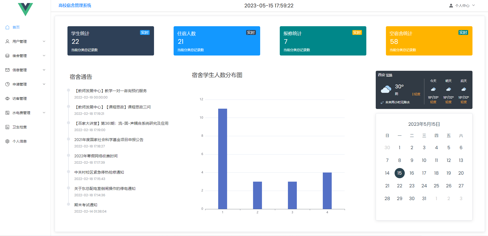
3.学生信息
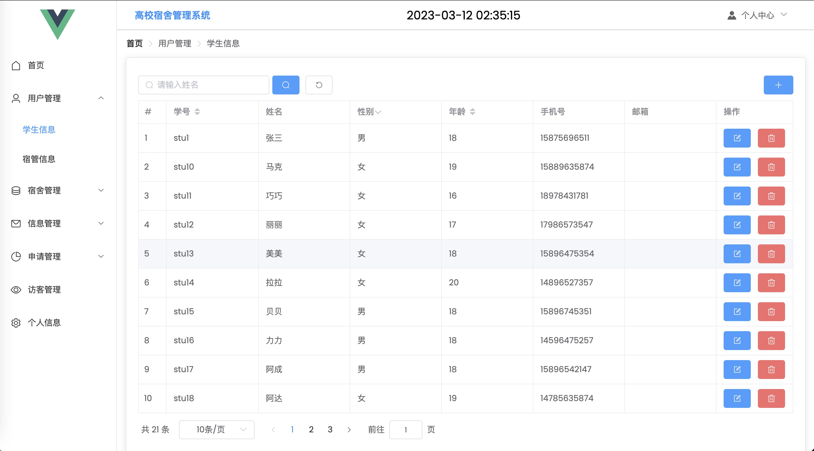
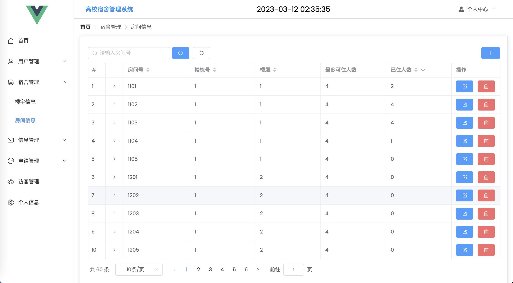
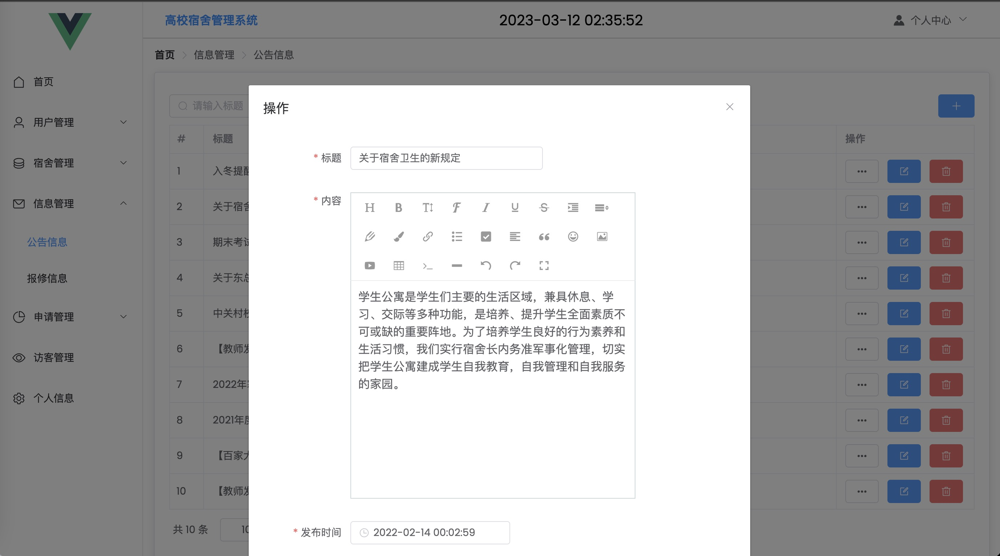
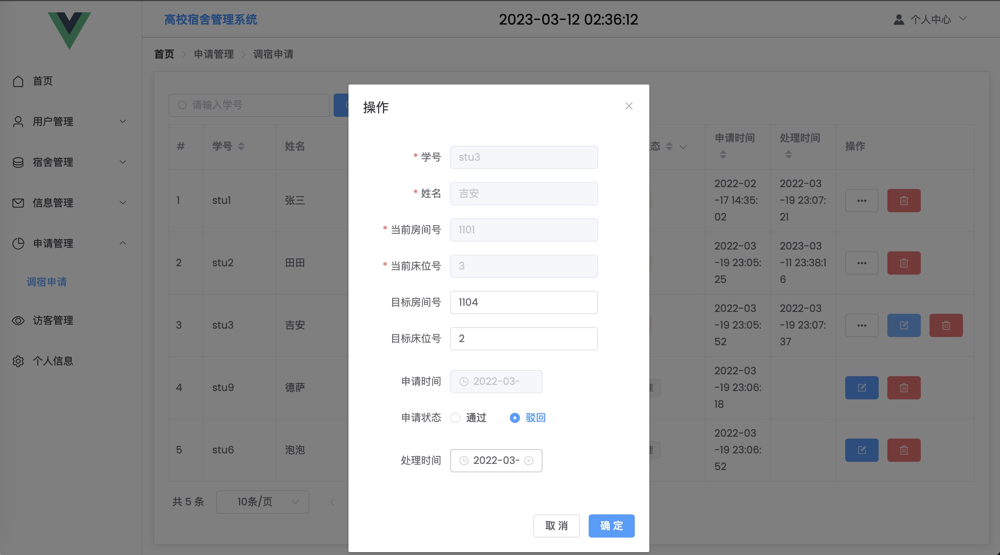
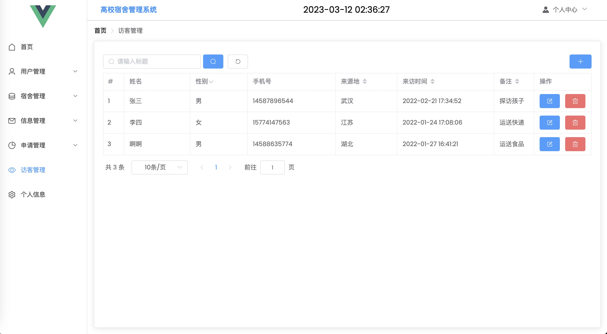
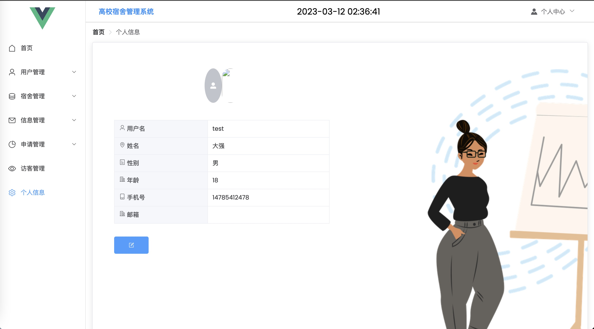
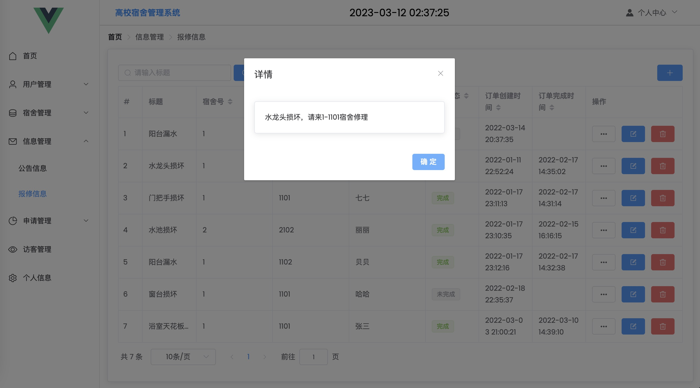

水费管理：

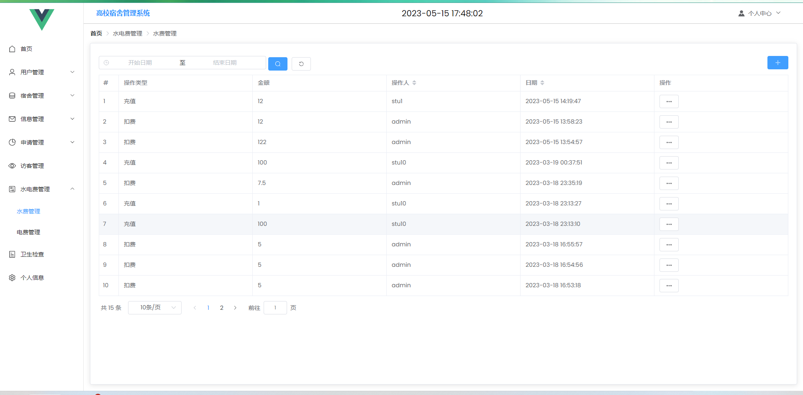

电费管理：

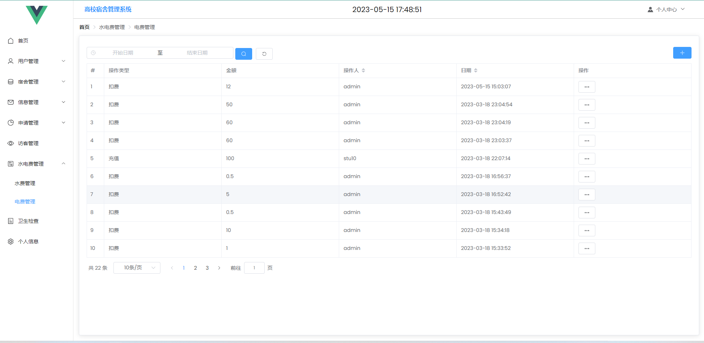

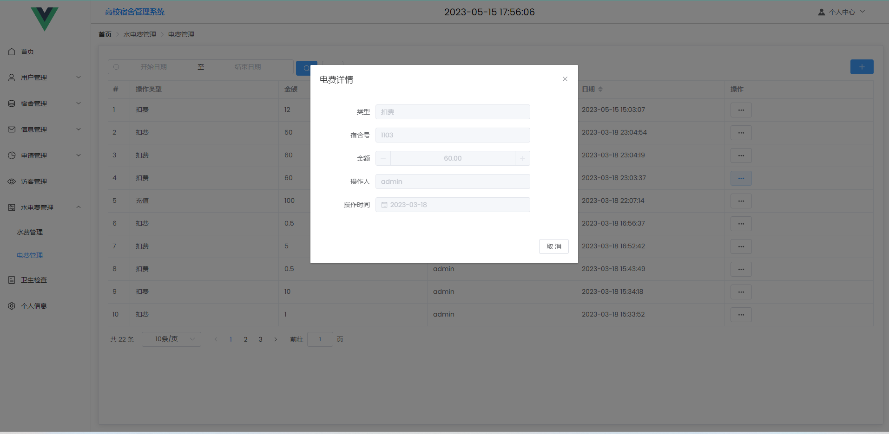

卫生检查：

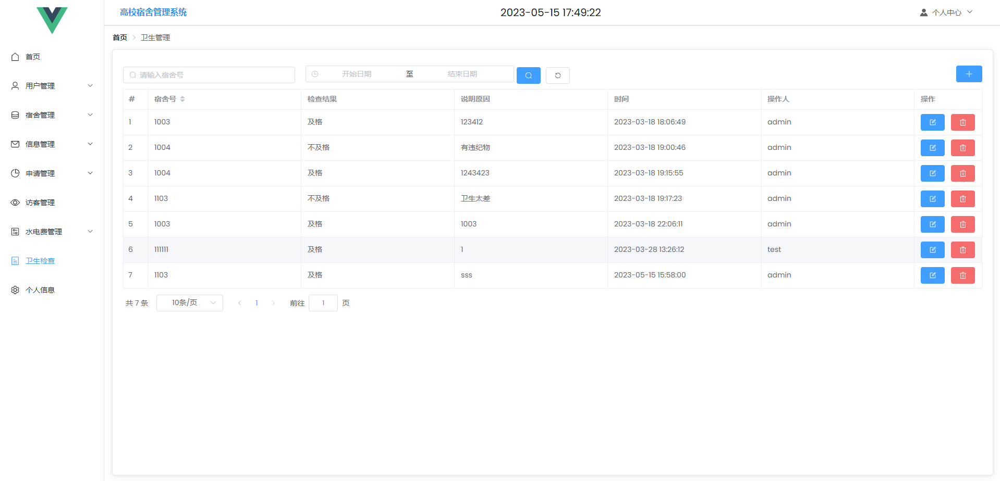
